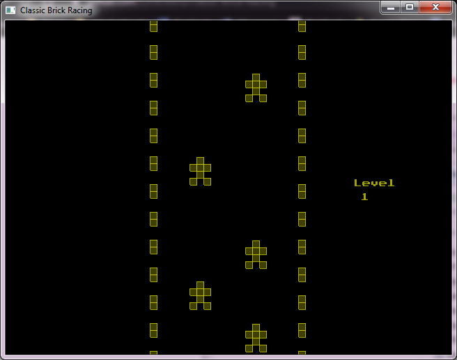

    This classic game is found on old handheld devices from the 90s. ( https://retroconsoles.fandom.com/wiki/Brick_Game ) 
    It uses the library SIGIL ( http://www.libsigil.com/ ) (v0.9.0)
    The font PressStart2P is also used ( https://www.dafont.com/press-start-2p.font )
    Compiles on Windows 7 with Code::Blocks 17.12 and MinGW32. 
    Guide for installing SIGIL on Code::Blocks, http://www.libsigil.com/docs/SIGIL_MinGW_CodeBlocks.pdf

     
